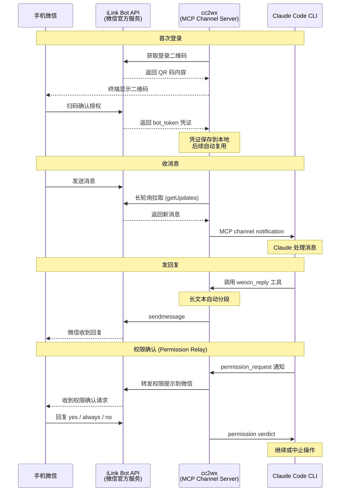
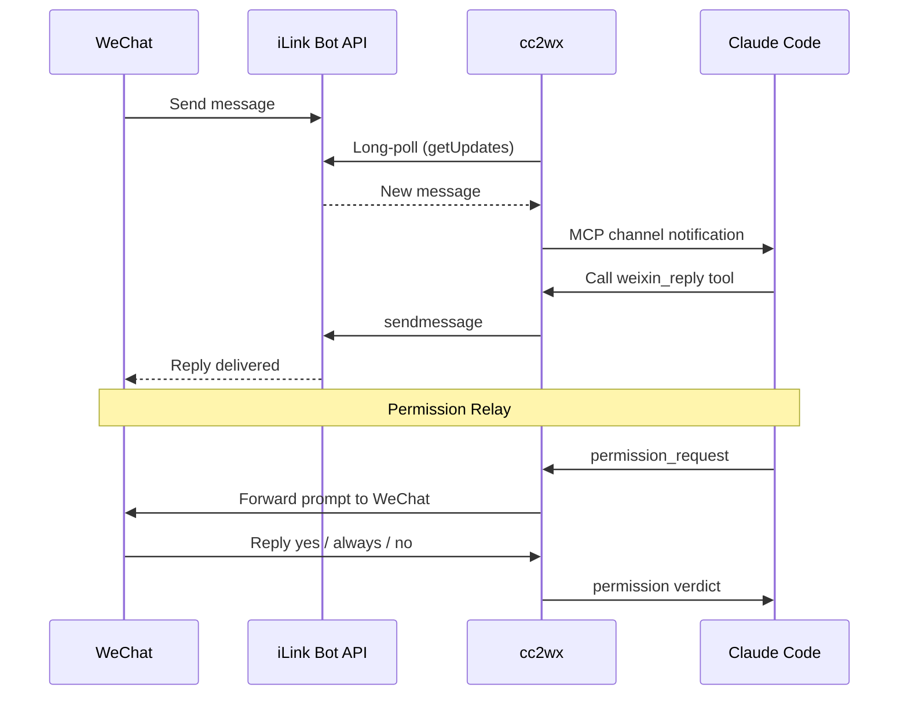

# cc2wx

```
   ██████╗ ██████╗██████╗ ██╗    ██╗██╗  ██╗
  ██╔════╝██╔════╝╚════██╗██║    ██║╚██╗██╔╝
  ██║     ██║      █████╔╝██║ █╗ ██║ ╚███╔╝
  ██║     ██║     ██╔═══╝ ██║███╗██║ ██╔██╗
  ╚██████╗╚██████╗███████╗╚███╔███╔╝██╔╝ ██╗
   ╚═════╝ ╚═════╝╚══════╝ ╚══╝╚══╝ ╚═╝  ╚═╝
      Claude Code ↔ WeChat Bridge
              by roxorlt
```

**用手机微信和本地 Claude Code 实时对话。**

> **Experimental** — 本项目依赖 Claude Code Channels（research preview）和微信 ClawBot（灰度测试中），两者均为实验性功能，随时可能变更。

*Read this in [English](#english)*

## 工作原理



cc2wx 是一个 MCP Channel Server，通过微信 [iLink Bot API](https://github.com/epiral/weixin-bot) 接收微信消息，再通过 Claude Code 的 [Channel 协议](https://code.claude.com/docs/en/channels) 实时推送给本地运行的 Claude Code 会话。Claude 的回复通过 `weixin_reply` 工具发回微信。

## 前提条件

- **Node.js** >= 18
- **Claude Code CLI** >= 2.1.81（需支持 Channels 和 Permission Relay）
- **微信 ClawBot 灰度资格** — 打开微信 → 我 → 设置 → 插件，看是否有「微信 ClawBot」。如果没有，说明你的微信号尚未被灰度到，暂时无法使用
- **macOS / Linux**（macOS 下自动使用 `caffeinate` 防休眠，Linux 直接运行）

## 快速开始

### 方式一：npx 一键运行（推荐）

```bash
npx cc2wx login    # 首次：扫码登录 → 自动启动 Claude Code
npx cc2wx start    # 后续：使用已保存凭证启动
```

### 方式二：从源码运行

```bash
git clone https://github.com/roxorlt/cc2wx.git
cd cc2wx
npm install
npm run login      # 首次登录
npm start          # 后续启动
```

### 登录流程

终端会显示二维码，用微信扫码确认授权。登录成功后自动启动 Claude Code。

凭证保存在 `~/.weixin-bot/credentials.json`，后续无需重复扫码。

### 启动后

在手机微信里给自己的微信号发消息，Claude Code 会实时收到并回复。

底层等价于：

```bash
caffeinate -i claude \
  --dangerously-load-development-channels server:cc2wx \
  --effort max
```

## 权限确认（Permission Relay）

cc2wx 支持 Claude Code 的 [Permission Relay](https://code.claude.com/docs/en/channels-reference) 协议。当 Claude 需要执行敏感操作时（如运行 Bash 命令、编辑文件），权限请求会转发到你的微信，你可以在手机上批准或拒绝。

**无需 `--dangerously-skip-permissions`，所有权限确认通过微信完成。**

微信收到的权限提示：

```
🔐 Claude 请求权限
工具: Bash
说明: List files in current directory

ls -1 /Users/you/project/

回复 yes 批准 / always 始终批准 / no 拒绝
```

| 回复 | 效果 |
|------|------|
| `yes` / `ok` / `好` / `y` | 批准本次操作 |
| `always` / `始终` / `总是` | 批准并记住，同类工具后续自动批准 |
| `no` / `不` / `拒绝` / `n` | 拒绝本次操作 |

「始终批准」的工具列表保存在 `~/.cc2wx/always-allow.json`，重启后仍然有效。删除该文件即可重置。

## 安全须知

### Permission Relay vs `--dangerously-skip-permissions`

**推荐使用 Permission Relay**（默认行为）。通过微信逐一确认每个敏感操作，安全可控。

如果你确定只在可信环境中使用，也可以添加 `--dangerously-skip-permissions` 跳过所有权限确认。此参数**跳过所有权限确认**，意味着 Claude Code 可以不经确认地执行任意 Bash 命令、编辑文件等。微信消息会作为 prompt 输入，理论上存在 prompt injection 风险。

### userId 白名单

设置白名单只允许你自己的微信 userId 触发 Claude：

在 `.mcp.json` 中配置：

```json
{
  "mcpServers": {
    "cc2wx": {
      "command": "npx",
      "args": ["tsx", "cc2wx.ts"],
      "env": {
        "CC2WX_ALLOWED_USERS": "your_user_id"
      }
    }
  }
}
```

或通过环境变量：

```bash
CC2WX_ALLOWED_USERS=your_user_id npm start
```

首次运行不设白名单，发一条消息后在终端日志中找到 `from=xxx` 获取你的 userId。

### `caffeinate -i`

`npm start` 和 `npm run login` 使用 `caffeinate -i` 阻止 macOS 空闲休眠（屏幕可以关闭），确保息屏后微信消息仍能送达。Claude Code 退出时 `caffeinate` 自动结束。

## 命令

### npx 方式

| 命令 | 说明 |
|------|------|
| `npx cc2wx login` | 扫码登录 → 保存凭证 → 自动启动 Claude Code |
| `npx cc2wx start` | 使用已保存凭证启动 Claude Code（含防休眠） |
| `npx cc2wx serve` | 单独运行 MCP server（调试用，不启动 Claude） |

### 源码方式

| 命令 | 说明 |
|------|------|
| `npm run login` | 扫码登录 → 保存凭证 → 自动启动 Claude Code |
| `npm start` | 使用已保存凭证启动 Claude Code（含防休眠） |
| `npm run serve` | 单独运行 MCP server（调试用，不启动 Claude） |

## 特性

- 微信消息实时推送到 Claude Code 会话
- 长回复自动分段发送（每段 ≤ 2000 字，按段落拆分）
- 权限确认转发到微信（Permission Relay），无需 `--dangerously-skip-permissions`
- 「始终批准」持久化，常用操作无需重复确认
- 登录凭证本地持久化，无需重复扫码
- 息屏防休眠，合盖也能保持通信
- userId 白名单过滤

## 已知限制

- **ClawBot 灰度** — 微信 ClawBot 功能尚在灰度测试中，不是所有微信号都能用
- **Channels research preview** — Claude Code 的 Channel 功能也是实验性的
- **单 context_token 回复上限** — iLink API 每条收到的消息最多回复约 10 条，超长回复可能丢失尾段
- **语音转录依赖 ClawBot STT** — 语音消息使用 ClawBot 服务端转录，转录失败时无法处理
- **macOS / Linux** — macOS 自动 `caffeinate` 防休眠，Linux 直接运行（Windows 未测试）

## 更新日志

### v1.3.1 (2026-03-24)

- 修复多条 permission 同时到达时的时序冲突问题

### v1.3.0 (2026-03-24)

- 支持接收来自微信的文件和语音消息

### v1.2.0 (2026-03-24)

- 支持接收来自微信的图片和视频消息

### v1.1.0 (2026-03-24)

- **Permission Relay** — 权限确认转发到微信，回复 yes/always/no，不再需要 `--dangerously-skip-permissions`
- **Always Allow 持久化** — 常用工具「始终批准」后自动通过，列表保存在 `~/.cc2wx/always-allow.json`，重启不丢失

### v1.0.2 (2026-03-23)

- 支持 `npx cc2wx` 一键运行

### v1.0.0 (2026-03-23)

- 首次发布
- 微信消息实时桥接到 Claude Code
- macOS 防休眠

## 致谢

- [weixin-ClawBot-API](https://github.com/SiverKing/weixin-ClawBot-API) — WeChat iLink Bot API 协议参考
- [weixin-bot](https://github.com/epiral/weixin-bot) — WeChat iLink Bot SDK
- [Claude Code Channels](https://code.claude.com/docs/en/channels) — MCP Channel protocol

## License

[MIT](LICENSE)

---

<a id="english"></a>

## English

**cc2wx** bridges your WeChat messages to a local Claude Code session in real time.

### How it works



### Prerequisites

- Node.js >= 18, Claude Code CLI >= 2.1.81
- WeChat with ClawBot plugin access (currently in grayscale rollout — not all accounts have it)
- macOS or Linux (macOS auto-wraps with `caffeinate` to prevent idle sleep)

### Quick start

```bash
npx cc2wx login   # first time: scan QR → auto-launches Claude Code
npx cc2wx start   # subsequent runs (reuses saved credentials)
```

Or from source:

```bash
git clone https://github.com/roxorlt/cc2wx.git && cd cc2wx && npm install
npm run login   # scan QR → auto-launches Claude Code
npm start       # subsequent runs
```

### Permission Relay

When Claude needs to run sensitive operations, approval prompts are forwarded to your WeChat. Reply `yes` to approve once, `always` to auto-approve that tool type going forward, or `no` to deny. No `--dangerously-skip-permissions` needed.

The always-allow list is persisted at `~/.cc2wx/always-allow.json`. Delete it to reset.

### Security

Set `CC2WX_ALLOWED_USERS` to your WeChat userId (find it in startup logs) to restrict who can interact with Claude through your session.

### License

[MIT](LICENSE)
